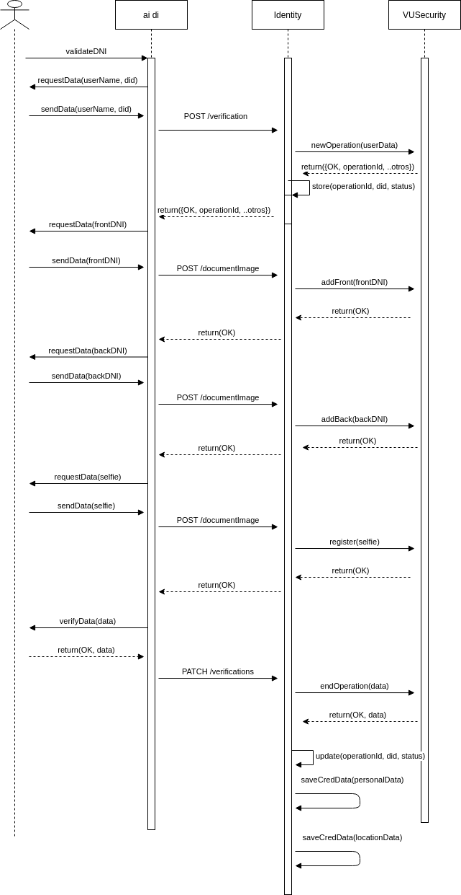
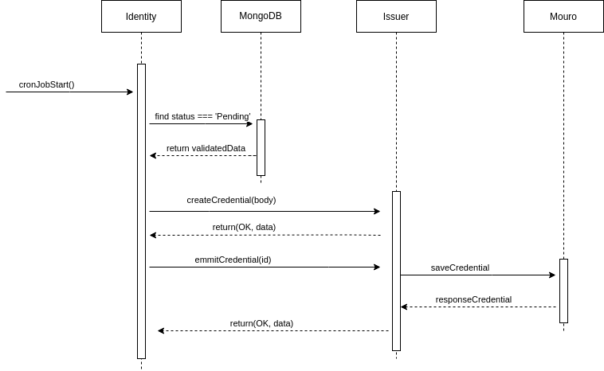

DIDI-SSI-Identity-Issuer es una herramienta que permite validar un documento de identidad. Se encarga de enviar los datos del usuario, incluyendo las imagenes del dni y una selfie a VU Security para ser validados. 
Se encuentra desarrollando en NodeJS y ExpressJs y almacena sus datos en MongoDB.

### Diagrama de Secuencias
A continuación se muestra el diagrama de secuencias del proceso de validación de identidad.

A continuación se muestra el diagrama de secuencias del proceso de creación y emisión de credenciales.

### Repositorios

- [**Indentity backend**](https://github.com/ong-bitcoin-argentina/DIDI-SSI-Identity-issuer)

### Swagger url

[**api docs**](https://identidad.qa.didi.org.ar/api-docs/)

### Rutas

#### /verififications
Se utilizan para la validación de un documento de identidad.
> /verififications (POST) - Crear un nuevo trámite de validación.

> /verififications (DELETE) - Cancelar un trámite. Si la operación se encuentra cancelada, no es posible volver a modificarla o continuarla.

> /verifications/:operationId/documentImage - Adherir una imagen a una operación. Se debe enviar como parámetro la imágen que se desea adherir. En el caso del front, se adhiere el frente del documento; en el caso del back, se adhiere el dorso del documento; y en el caso de selfie, se adhiere la selfie del usuario. Para todos los casos, es necesario que este creada la operación, y que no se encuentre cancelada o finalizada.

> /verifications/:operationId - Finalizar un trámite para un usuario determinado y devuelve los datos documentales de la operación.

> /verifications/:did - Obtener el estado del trámite.

> /verifications/:operationId/:userName - Obtener los datos del documento analizado.

### Services

#### AuthRequest
Son rutas que permiten verificar, actualizar y almacenar en una colección, los pedidos de validación de identidad contra un proveedor de identidad (VU Security).

#### Credential
Este servicio permite preparar la información y el formato necesario para emitir credenciales de identidad (datos personales y domicilio legal).

#### DidiServer
Este servicio permite verificar si el token de usuario existe en Didi Server.

#### Issuer
Es el encargado de crear y emitir credenciales. 

#### Redis
Este servicio permite almacenar datos en la cache.

#### VuService
Realiza validaciones de identidad con VU Security. Este proceso cuenta con los pasos de enviar imágenes del frente y dorso del DNI, y foto de la persona. 