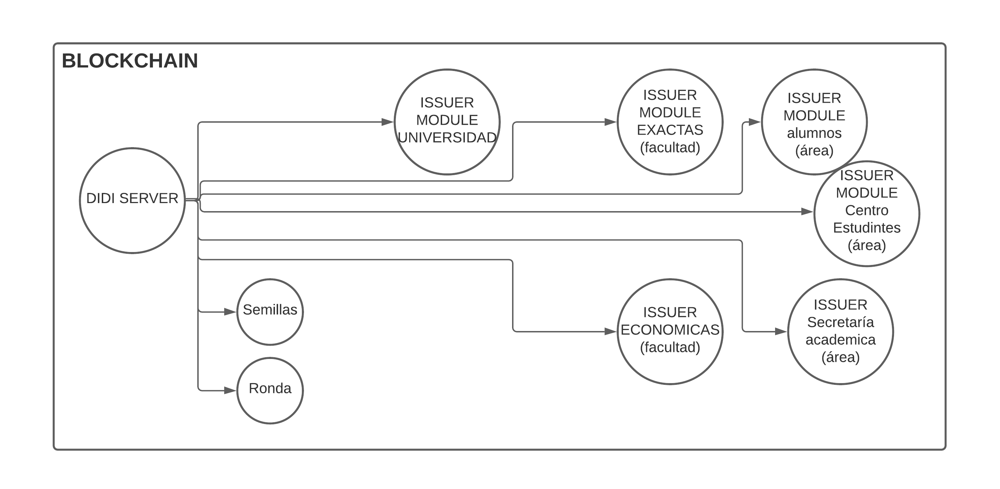

## Delegaciones en Blockchain
Para realizar una nueva delegación, se debe llamar a la función `addDelegate(...)`. 

```
function addDelegate(address identity, address actor, bytes32 delegateType, address delegate, uint validity) internal onlyOwner(identity, actor) {
    delegates[identity][keccak256(delegateType)][delegate] = now + validity;
    emit DIDDelegateChanged(identity, delegateType, delegate, now + validity, changed[identity]);
    changed[identity] = block.number;
}
```

Para el parámetro delegationType se utiliza `delegateTypes.Secp256k1SignatureAuthentication2018`, una constante definida en `ethr-did-resolver`.

El modificador `onlyOwner` afecta a la función permitiendole realizar la operación sólo al dueño (owner) de la identidad. 

Otra función de interés a nivel smart contract es `validDelegate(...) returns(bool)`. Esta retorna `true` si es delegado.

```
function validDelegate(address identity, bytes32 delegateType, address delegate) public view returns(bool) {
    uint validity = delegates[identity][keccak256(delegateType)][delegate];
    return (validity > now);
}
```
> Esta función solo verifica la delegación a un nivel. Para verificar una secuencia de delegaciones, se debe realizar a nivel aplicación.

### Delegaciones en Blockchain Manager
El Blockchain manager no agrega funcionalidad sobre las verificaciones sobre una blockchain. Actualmente su responsabilidad es el ruteo a las distintas blockchain soportadas por DIDI.

Una opción que estamos analizando a futuro, es que soporte cadenas de delegaciones: el blockchain manager debería recorrer el árbol de delegaciones y comprobar si, por transición, una delegación es válida. 
Para realizar esto, cada vez que se realiza una delegación se emite el evento `DIDDelegateChanged` con los cuales se debe armar el árbol de delegaciones y realizar esta verificación.

### Delegaciones en DIDI-Server
- router.post("/issuer",

Esta ruta crea un nuevo documento en la colección `DelegateTransaction`. 
Estos documentos luego son procesados por un job, que realiza las tx en el mismo orden que se recibieron y almacena el resultado en la colección `Delegate`. Esto se realiza para evitar race conditions.

### Delegaciones en Issuer
- router.post("/delegate/,

Realiza la delegación en blockchain, y posteriormente almacena el resultado en la colección `Delegate`. Es similar a las delegaciones en DIDI-Server, con la diferencia de que no encola las delegaciones para ser procesadas posteriormente.

### Delegaciones y emisión de credenciales.


Inicialmente, DIDI-Server es capaz de emitir credenciales. Actualmente es el encargado de emitir las credenciales por la verificación de número de teléfono, por la verificación de email y por la verificación de identidad.

Desde el DIDI-Server se relizaron delegaciones a ronda y a Semillas, otorgandoles la capacidad de emitir credenciales.


Para ejemplificar un caso de uso interesante, suponemos la estructura organizacional de una Universidad. Al realizar una delegación a una instancia de DIDI-Issuer-Module (ISSUER MODULE UNIVERSIDAD), este tiene la capacidad de emitir credenciales, y a su vez de realizar delegaciones. Las delegaciones se pueden hacer sobre otras instancias de DIDI-Isuer-Module (ISSUER MODULE EXACTAS (facultad), ISSUER MODULE alumnos (área), ISSUER MODULE Centro Estudiantes (área)) o a un nuevo tipo de Issuer desarrollado por terceros (ISSUER ECONOMICAS (facultad), ISSUER  Secretaría académica (área)).

Estas cadenas de delegaciones no se encuentran soportadas. En caso de necesitar este tipo de estructuras, las delegaciones se deben hacer desde el DIDI-Server. Queda la estructura de delegaciones en la forma de nodo central DIDI-Server.

