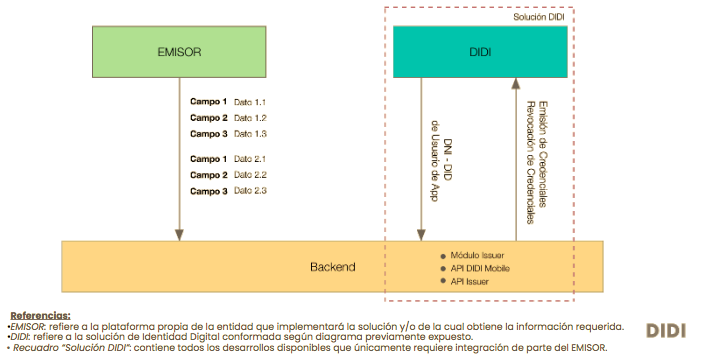

## Emisor de Credenciales

## Alcance
Para la correcta implementación de la misma, se deberán relevar las reglas e información que se emitirá dentro de las credenciales, de manera de poder identificar necesidades funcionales propias del modelo:
Tipos de credenciales (formativas, laborales)

Qué datos deberán contener las credenciales que se desea emitir de acuerdo a las decisiones operacionales, marco normativo, etc. (Por ejemplo: # de órdenes mensuales, tiempo conectado en la plataforma, kms recorridos, # cancelaciones acumuladas, criterios de reputación)
Cuáles son las reglas propias de negocio a fin de identificar la lógica por la que se emitirán y/o revocarán las credenciales. (Por ejemplo, periodicidad de emisión de las credenciales, actualización de la información, etc.

### Modelo de Emisión de Credenciales Verificables

## La emisión de las Credenciales
Existen dos vías posibles de emisión masiva de credenciales.

### Emisión Manual de Credenciales
Para la emisión de Credenciales Verificables, el primer paso del emisor será definir qué campos y datos queremos que contengan. Con estas definiciones se podrá dar de alta uno o más formatos de credencial en el portal web del emisor.

Desde el portal web del emisor se podrán emitir credenciales de forma manual y masiva mediante la carga de un archivo csv.

### Emisión Automática de Credenciales
#### Creación de pre-credenciales
Se crean pre-credenciales a partir de los datos del trabajador.

Las pre-credenciales contendrán la información necesaria para la creación de la credencial y estarán a la espera de que se informe cuál es el DID (Decentralized Identifier) destinatario al que deberán ser emitidas

#### USUARIO INFORMA IDENTIDAD Y EMISIÓN DE CREDENCIALES
Desde la App DIDI el usuario podrá informar su DID al backend y de esta forma el proceso podrá emitir su credencial.

#### RECEPCIÓN DE CREDENCIAL EN APP DE USUARIO
Al emitirse la credencial, esta será recibida en la App DIDI por el titular.

_Las credenciales se emiten en formato **jwt**, por lo que pueden ser fácilmente leídas si el usuario decidiera compartirlas con un tercero._

## Consideraciones Técnicas
Para evaluar los tiempos de desarrollo necesarios para avanzar en la emisión automática de credenciales se debe tener en cuenta que **DIDI proveerá**:

* Solución compuesta por el módulo emisor que deberá darse de alta en un servidor a cargo de la entidad emisora. Se contará con el código fuente y la documentación para una correcta implementación. (Se estima un tiempo de 3 a 4 horas) [ver [Arquitectura](https://didi.org.ar) para más detalle]

* API Issuer: utilizada para la creación, emisión y revocación de las credenciales.

* API DIDI: expone información necesaria desde la App DIDI para identificar al receptor final de las credenciales a emitir. Informa el DID asociado a un documento nacional de identidad (DNI).

El **emisor** deberá resolver:
* Definiciones funcionales según reglas de negocio y campos disponibles. Esto implica, entre otras cosas, lógicas de emisión de credenciales, periodicidad en los procesos de consulta, de emisión y de actualización de la información.
* Definición de qué tipos de credenciales se desea emitir (Por ejemplo: Formativas/historial laboral/reputacionales).
* Definición de campos que almacenará la credencial.
* Dimensionamiento del proceso según cantidad de consultas a efectuar en su base de datos, cantidad de datos y parámetros.
* Desarrollo API con campos/datos necesarios según lo relevado a integrar con solución DIDI.
* Desarrollo de proceso de creación de pre-credenciales (implica desarrollo de reglas de emisión/revocación) y guardado en DB del emisor. Así como, endpoint para recepcionar DNI-DID de API DIDI.

## Arquitectura

